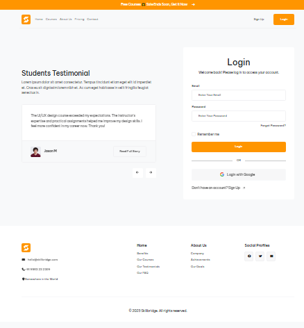
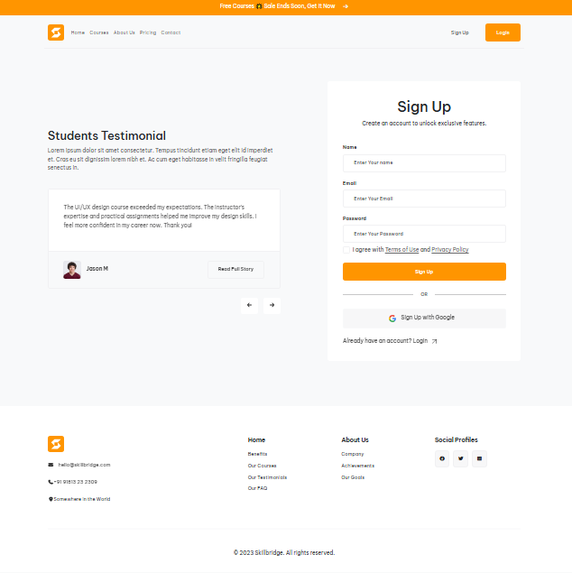
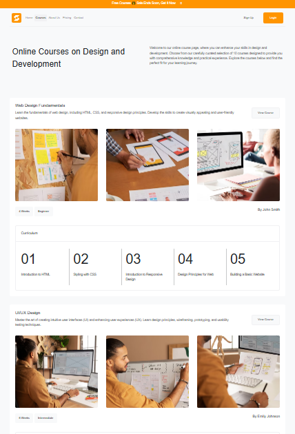
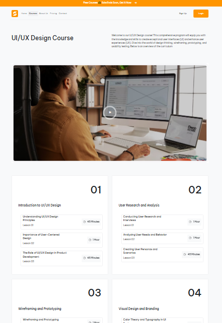
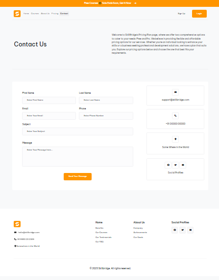

# Project‑Bootstrap

**Practicing Bootstrap with Sass using Node.js for build and dependency management.** :contentReference[oaicite:2]{index=2}

A simple front‑end project that demonstrates responsive layout and style using the **Bootstrap framework** along with **Sass preprocessing** and **Node.js tooling** for compilation and workflow.

---

## 🚀 Features

✔ Practice and implementation of **Bootstrap classes and components**  
✔ Sass (SCSS) support for modular and maintainable styling  
✔ Uses **Node.js** tools for building and serving the project  
✔ Responsive and mobile‑friendly design  
✔ Starter setup for learning front‑end workflow  

---

## 📁 Folder Structure
├── node_modules/ # Installed packages
├── src/
│ ├── images/ # images file
│ ├── icons/ # svg icons
│ ├── scss/ # Sass source files
│ └── index.html # Main HTML file
│ └── courses.html # Courses html file
│ └── courses-details.html # Courses detail HTML file
│ └── login.html # Login HTML file
│ └── signup.html # Signup HTML file
│ └── contact.html # Contact HTML file
├── package.json # Project metadata & scripts
├── vite.config.js # Build tooling configuration
├── package-lock.json # Locked dependencies
└── README.md # This document

---

## 🛠 Technologies Used

- **HTML**  
- **CSS / SCSS (Sass)**  
- **Bootstrap** – a popular front‑end responsive framework :contentReference[oaicite:3]{index=3}  
- **Node.js** – for running build scripts  
- **Vite** – development server & build tool

---

##  Screenshot

- **Home Page** 
 
- **Login Page** 
 
- **Sign Up Page** 

- **Courses Page** 
  
- **Courses Details Page** 

- **Contact Page** 
 